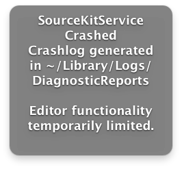
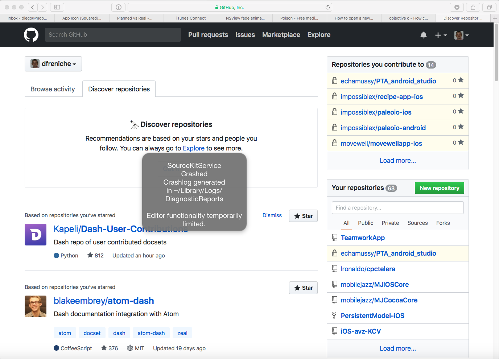
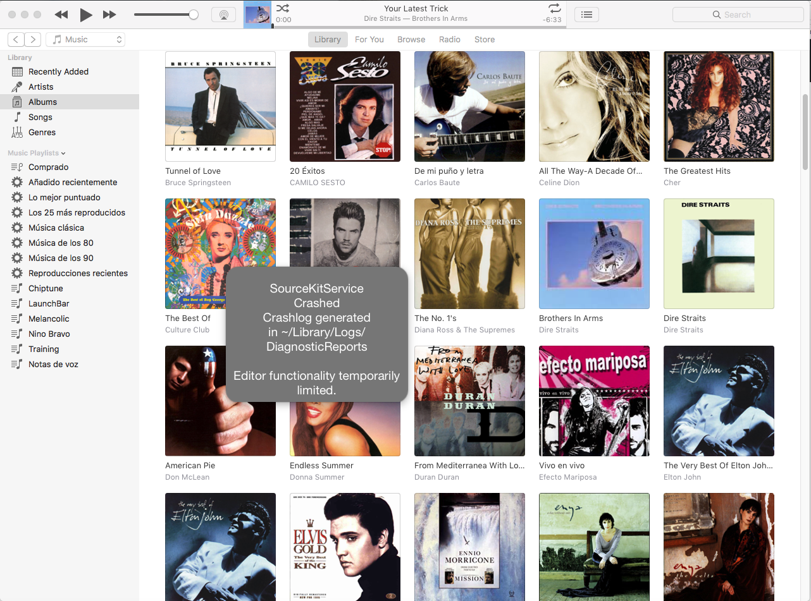

# CrashLet: for those who remember "let" mutable Arrays in Swift

If you've been using Swift from the very beginning, maybe you remember that dreaded message when the compiler crashed and no code completion / systax coloring worked at all. CrashLet brings you first-class crash Swift experiences, now system-wide.

With CrashLet you can experience that loved message from time to while, while you read your mail, surf the Internet or listen to music in Itunes. It works even while you're developing with Android Studio, just to remind you about how good Swift is at crashing!

_Crashlet while Githubbing_

_Do you want to listen to music? Crash!_

## Who's responsible for this

As a researcher in recent, very recent Apple history, [Diego Freniche](http://www.github.com/dfreniche/cv) takes pride in giving you the most accurate Swift crashing emulation experience to date. 

Other fine software projects hosted here are [Objective Doge](https://github.com/dfreniche/objective-doge), such extension of the Objective C language!, Wow!, Very clareness, much coding and Swift examples including [The Star Wars Operators](https://github.com/dfreniche/Playgrounds/blob/master/StarWarsOperators.playground/section-1.swift) 

## Install

- clone this repo
- build in Xcode

After all, this is a toy for developers, right?

## Sharing

Feel free to fork this repo, use the code in it or add new features through Pull Requests. Also, if you spot a typo in the documentation, or a bug in the app, please open an Issue. You don't even need to program to contribute to CrashLet, just create a video tutorial on how to use it, recommend ways of crash Swift more often, etc.

This work is licensed under a MIT license.

No `lldb` compilers where harmed during the writing of CrashLet.
